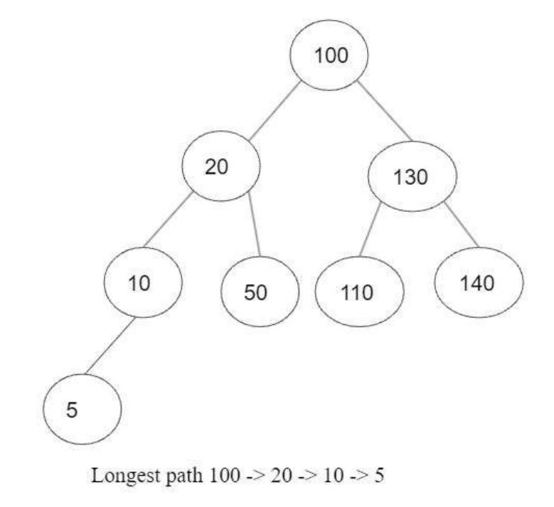

# PratviShah_DSALabSolution

## Question 1 [MARKS 10]
Write a program of Balancing Brackets, use a suitable data structure to print whether the string entered is a Balanced Brackets or Unbalanced String.\
Sample input\
( [ [ { } ] ] )\
Sample Output\
The entered String has Balanced Brackets\
Sample Input\
( [ [ { } ] ] ) )\
Sample Output\
The entered Strings do not contain Balanced Brackets

## Question 2 [MARKS 10]
Print the longest path from the root to the leaf in a binary tree.

Instructions
1) You can declare class Node, in the same class as driver class.
2) You can write programming logic/functions in one class itself.
3) You can hardcode the inputs.
